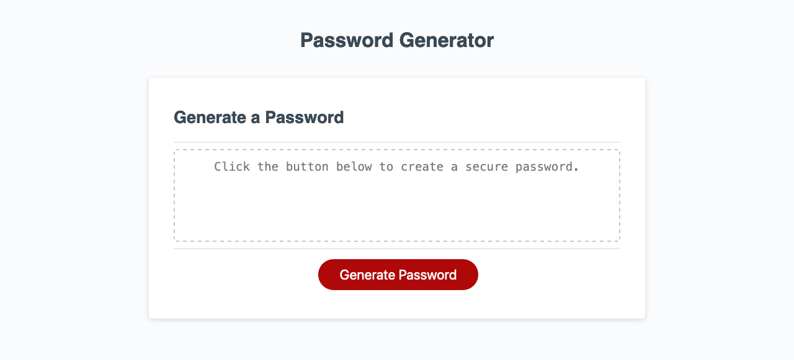

# Javascript Password Generator
## Description
This is a javascript webapp that enables the user to generate a complex password. The user can select options for their password, including length, uppercase or lowercase letters, special characters, and numbers.

## Screenshots

## Built With
- Vanilla JS
- HTML
- CSS

## Deployed Site
[https://harmoniacodes.github.io/password-generator/](https://harmoniacodes.github.io/password-generator/)

